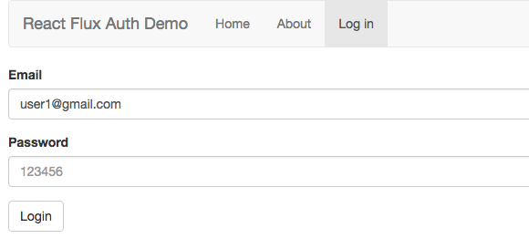

# Authentication with React & Flux
> An authentication application utilizing React + Flux + React Router



## Introduction

* React: is a JavaSciprt library for creating user interfaces.
* Flux: is application architecture that Facebook uses for building client-side web applications.
* Webpack: is a tool for bundling all dependencies (node modules) into javascript file.
* Babel: is a tool using for trasforming in your code, such as transform JSX to JS, ES6 to ES5.

## Installation

1.Install all node modules (build into *node_modules* folder) 

```
npm install
```

2.Run

* Development Environment: Run on *webpack-dev-server*

	* Start webpack-dev-server. You can change config of server (IP, port) in *package.json*.

		```
		npm start
		```

 	* Go to url

		```
		http://localhost:8080
		```

* Production Environment: Run on server (Nginx, Apache, ...)

	* Bundle all files into a javascript file. Using *path* and *filename* in *webpack.config.js* to specify the information of bundle file.

		```
		npm run build 
		``` 

 	* Include it into html by script tag.

		```
		<script type="text/javascript" src="build/js/bundle.js"></script>
		```

 	* Config server and run in browser.

## Login

```
Email: user1@gmail.com
Password: 123456
```

## Reference

https://auth0.com/blog/2015/04/09/adding-authentication-to-your-react-flux-app/